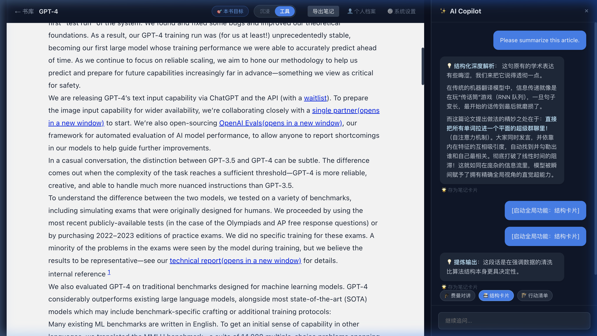
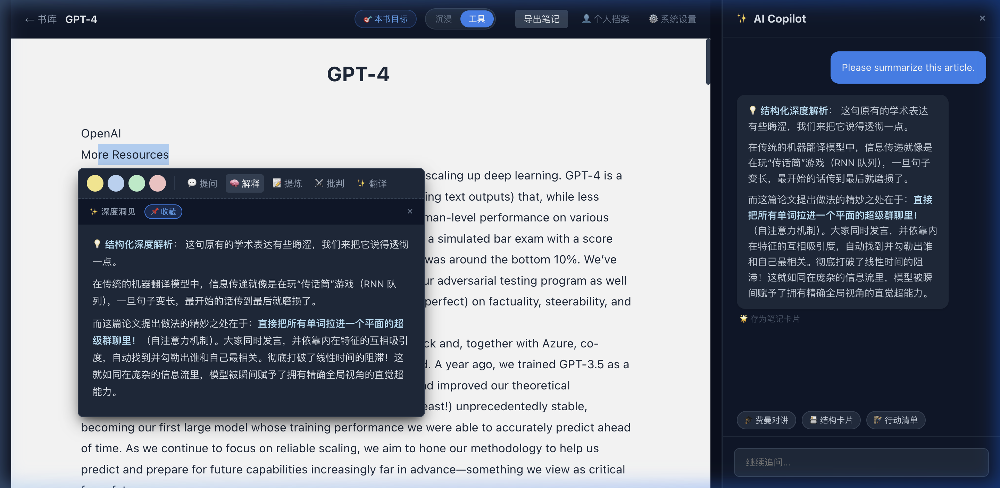
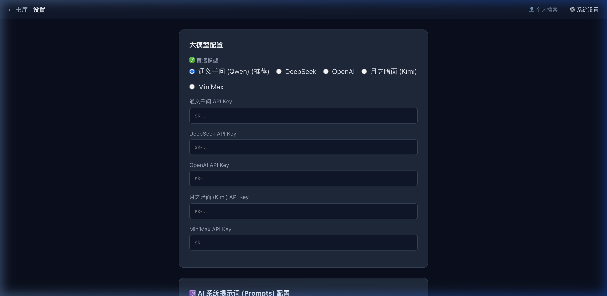
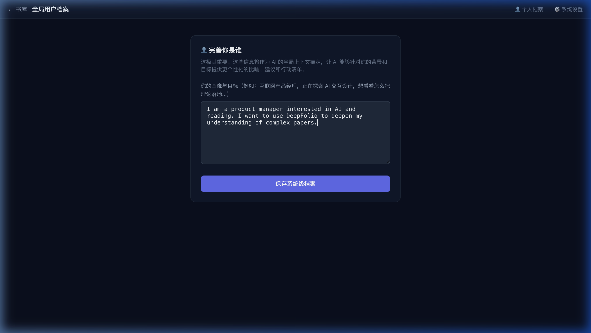

<div align="center">
  <h1>📖 DeepFolio </h1>
  <p><strong>把书读厚，也把书读薄。一个将 AI 能力深度融合于阅读流的本地化辅助阅读工具。</strong></p>
</div>

---

## 🌟 核心理念

我们厌烦了在传统 PDF 阅读器和 ChatGPT 之间疲于奔命地回切复制，也厌烦了一股脑把几十万字喂给模型换来的高昂 Token 账单与常常发生的网络超时。

**Reader** 的诞生基于一个极简的愿景：**让 AI 顺滑地住在你的书里，成为你的专职陪读。**

### 核心特性
1. **📉 双轨制激进控费引擎 (Dual-Track AI)** 
   拒绝把长文整本暴击 Token！系统特有**双轨并行机制**，全局只抽取首尾 15000 字符建立大纲；精读时采用**滑动视口算法**（自动截取当前屏幕上下 40 段投喂），做到“看到哪，算到哪”，帮您死死守住钱包。
   

2. **📐 L0-L3 三维极简空间防塌陷 UI**
   采用严苛的视觉层级管控，AI 解释与划线悬浮菜单像水流一样依附于正文边缘，沉浸感极强，专为高密度长篇论文排版解构。
   

3. **🔌 Qwen 首发推荐，多模型统一接入** 
   默认并深度适配 **通义千问 (Qwen)**，开箱即用。同时原生支持无缝设置切换 DeepSeek, OpenAI 等。
   

4. **🪨 纯血本地优先 (Local-First)**
   没有任何远端同步阴谋。底层强制实施 SQLite 数据库和本地 Markdown 的双写机制，你的读书笔记和高亮永远攥在自己硬盘里。

5. **🪪 专属个人档案与目标设定 (User Profile & Goal)**
   我们深怀共识：同样的文献，对程序员、法学教授和高中生是不一样的。通过事先配置用户档案，所有的解读、联想与行动清单都会化身为完完全全针对您的“定做辅导”模型。
   

## 🚀 极客五分钟上车指南

本项目为纯粹的 **Node.js + React Monorepo** 全栈项目。您的同事和朋友仅需遵循以下命令即可发车：

### 1. 前置要求
- Node.js >= 18
- 请确保您使用的网络环境能够顺畅 `npm install`。

### 2. 克隆与安装

```bash
git clone https://github.com/your-username/reader.git
cd reader
npm install
```

### 3. 配置模型密钥 (API Key)
为保护隐私，代码中不含默认 Key。请在后端目录进行环境变量挂载：

```bash
cd packages/backend
cp .env.example .env
```
用文本编辑器打开这台机器上的 `.env` 文件，在 `QWEN_API_KEY=` 后面填入您从阿里云申请的千问 API 密钥。

### 4. 启动服务
我们使用了 `npm workspaces` 和 `concurrently` 实现了一键拉起双端：

```bash
# 回到项目根目录
cd ../..
npm run dev
```

成功后，终端会打印出前后端端口信息。
请打开浏览器访问：[http://localhost:5173/](http://localhost:5173/)，进入您的赛博书房。

---

## 🛠️ 关于数据资产的隐私声明
您上传的所有 EPUB/PDF、高亮的文本以及 AI 为您生成的私密对话，均存储在这个项目**外层根目录**的 `data/` （SQLite 库）和 `reader-notes/` 文件夹中。  
所有的知识资产都是肉眼可见的物理文件，随带随走。我们已在 `.gitignore` 层屏蔽了这几个文件夹，您尽可在您的本地分发修改，也绝不会发生笔记通过 commit 提交到公共网络的致命失误。

---

## 🤝 参与共建
欢迎加入 EBAW 多智能体纯视觉验收体系下的代码构建挑战，遇到任何 BUG 欢迎提出 Issue！
